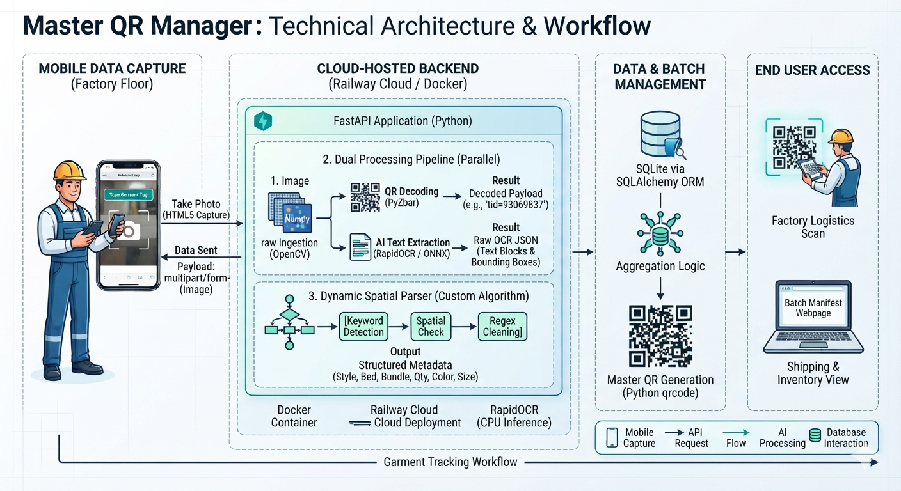

# Factory Ticket Scanner — QR Manager

A **mobile-first, 100% offline-capable Progressive Web App (PWA)** for garment factory inventory tracking. Workers scan QR-coded production tickets on the factory floor — with or without internet — and sync all data to the cloud at the end of their shift.

---

## Table of Contents
- [Overview](#overview)
- [Architecture](#architecture)
- [Tech Stack](#tech-stack)
- [Project Structure](#project-structure)
- [Deployment](#deployment)
- [Environment Variables](#environment-variables)
- [Running Locally](#running-locally)
- [User Manual](#user-manual)

---

## Overview

The app solves a core factory problem: **QR code scanners need internet, but factory floors often don't have reliable signal.**

**Solution — Three-phase offline workflow:**

1. **Sync Phase (morning, on Wi-Fi):** Download all production ticket data from the Qiaofei ERP system into the phone's browser storage (IndexedDB).
2. **Scan Phase (all day, no internet needed):** Scan physical QR codes. The app auto-fills ticket metadata from IndexedDB instantly. All scans are saved locally.
3. **Push Phase (end of shift, on Wi-Fi):** Upload all scanned records to the cloud TiDB database in one click.

---

## Architecture

```
Factory Floor
    │
    ▼
[Mobile Browser PWA]  ◄──── Offline (IndexedDB)
    │
    │  API calls (via HTTPS)
    ▼
[FastAPI Backend]  ─────────────────────────────► [TiDB Serverless Cloud DB]
    │
    │  Proxied through Cloudflare Worker
    ▼
[Qiaofei ERP API] (Huawei Cloud)
```

> **Why the Cloudflare Worker Proxy?**
> The Qiaofei ERP API (hosted on Huawei Cloud) blocks Oracle Cloud datacenter IPs. A Cloudflare Worker is used as a transparent edge proxy to relay all backend API requests, bypassing the IP block without any additional cost.



---

## Tech Stack

| Layer | Technology |
|---|---|
| Backend | Python 3.11, FastAPI, Uvicorn |
| Frontend | Vanilla JS, HTML5, Tailwind CSS |
| Offline Storage | IndexedDB (browser-side) |
| PWA Support | Service Worker, Web App Manifest |
| Database | TiDB Serverless (MySQL-compatible) via SQLAlchemy |
| QR Scanning | `html5-qrcode`, `pyzbar`, OpenCV |
| Containerization | Docker |
| Hosting | Oracle Cloud (Always Free), Coolify |
| Proxy | Cloudflare Workers (edge proxy for Qiaofei API) |

---

## Project Structure

```
.
├── main.py                  # FastAPI app — all routes and API endpoints
├── qiaofei_sync.py          # Qiaofei ERP sync endpoint (server-side)
├── database.py              # TiDB database connection (SQLAlchemy)
├── models.py                # SQLAlchemy ORM models
├── schemas.py               # Pydantic request/response schemas
├── requirements.txt         # Python dependencies
├── Dockerfile               # Container build (includes self-signed HTTPS cert)
│
├── templates/
│   ├── offline_app.html     # Main PWA — full offline-capable scanner app
│   ├── dashboard.html       # Admin dashboard (scan history overview)
│   ├── history.html         # Scan history viewer
│   ├── collection_manager.html  # Collection management UI
│   └── public_view.html     # Public-facing QR verification view
│
├── static/
│   ├── manifest.json        # PWA manifest (enables "Add to Home Screen")
│   ├── sw.js                # Service worker (enables offline mode)
│   └── icon.png             # App icon
│
├── docs/
│   └── technical_workflow.png  # System architecture diagram
│
├── USER_MANUAL.md           # Factory worker user guide (English + 简体中文)
└── USER_MANUAL.docx         # Factory worker user guide (Word format)
```

---

## Deployment

The app is deployed on **Oracle Cloud (ap-tokyo-1)** using **Coolify** for automated Docker deployments from GitHub.

- **Server IP:** `141.147.165.228` (accessible from mainland China)
- **App URL:** `https://141.147.165.228:7861/offline`
- **Coolify Dashboard:** `https://141.147.165.228:8440`

> **Note for iOS/Android camera access:** Modern browsers block camera access on non-HTTPS connections. This app uses a self-signed certificate (generated at container startup). Users will see a "Not Secure" warning the first time — this is expected. Click **Advanced → Proceed** to enter the app.

### Deploying via Coolify

1. In Coolify, create a new application from the `ChakradharWugroup/qrcode` GitHub repository.
2. Set the **Build Pack** to **Dockerfile**.
3. Set **Ports Exposes** to `7860` and **Port Mappings** to `7861:7860`.
4. Add all required **Environment Variables** (see below).
5. Click **Deploy**.

---

## Environment Variables

Set these in Coolify → Application → Environment Variables:

| Variable | Description | Example |
|---|---|---|
| `QIAOFEI_MOBILE` | Qiaofei account phone number | `933762865` |
| `QIAOFEI_PASSWORD` | Qiaofei account password (plain text) | `YourPassword` |
| `QIAOFEI_AREA_CODE` | Country calling code | `886` |
| `QIAOFEI_PROXY_URL` | Cloudflare Worker proxy base URL | `https://dark-lab-2998.kallec.workers.dev` |

---

## Running Locally

```bash
# Clone the repo
git clone https://github.com/ChakradharWugroup/qrcode.git
cd qrcode

# Create and activate a virtual environment
python -m venv venv
venv\Scripts\activate  # Windows
source venv/bin/activate  # macOS/Linux

# Install dependencies
pip install -r requirements.txt

# Set environment variables
set QIAOFEI_MOBILE=your_mobile
set QIAOFEI_PASSWORD=your_password
set QIAOFEI_AREA_CODE=886
set QIAOFEI_PROXY_URL=https://your-cloudflare-worker.workers.dev

# Run the server
uvicorn main:app --host 0.0.0.0 --port 7860 --reload
```

Open: [http://localhost:7860/offline](http://localhost:7860/offline)

---

## User Manual

See [USER_MANUAL.md](USER_MANUAL.md) for step-by-step instructions for factory workers in English and Simplified Chinese (简体中文).
